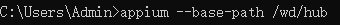
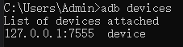
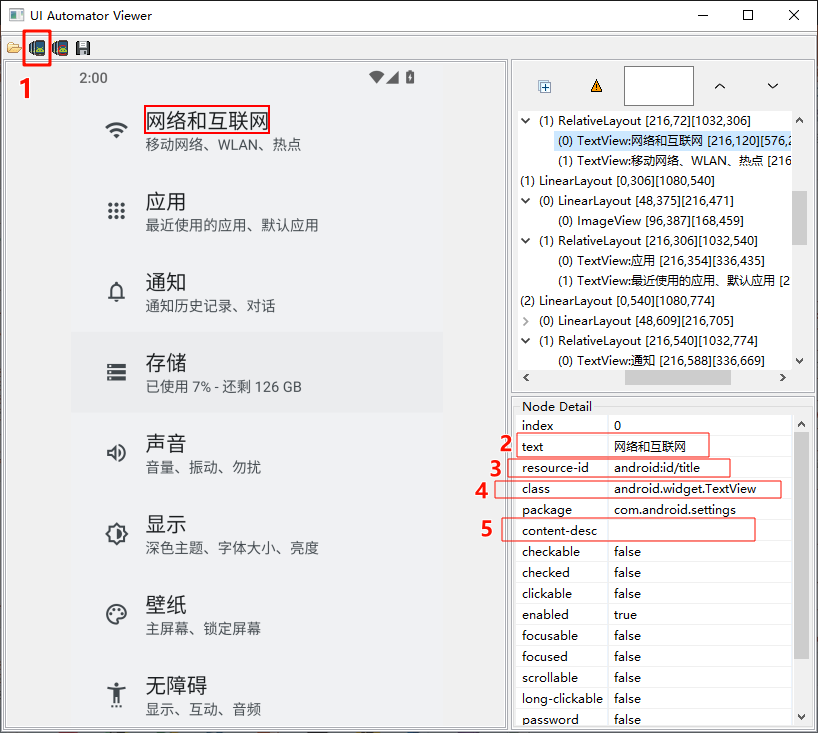
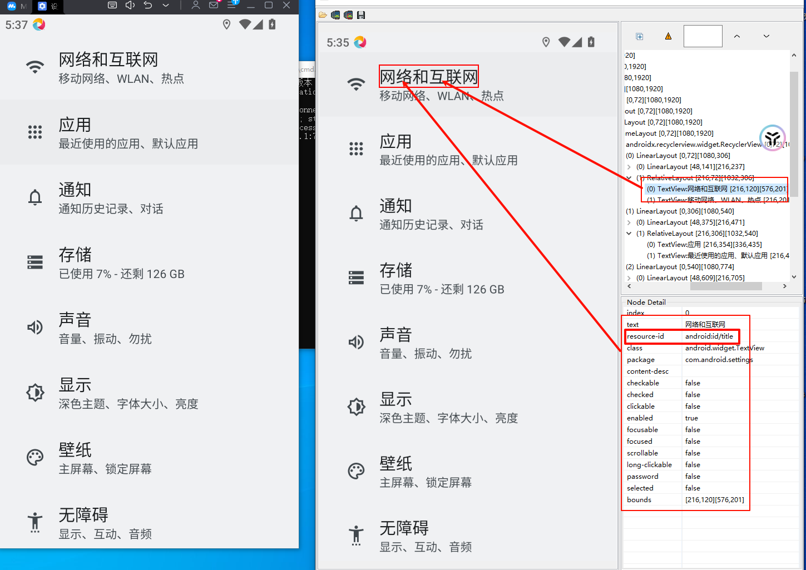
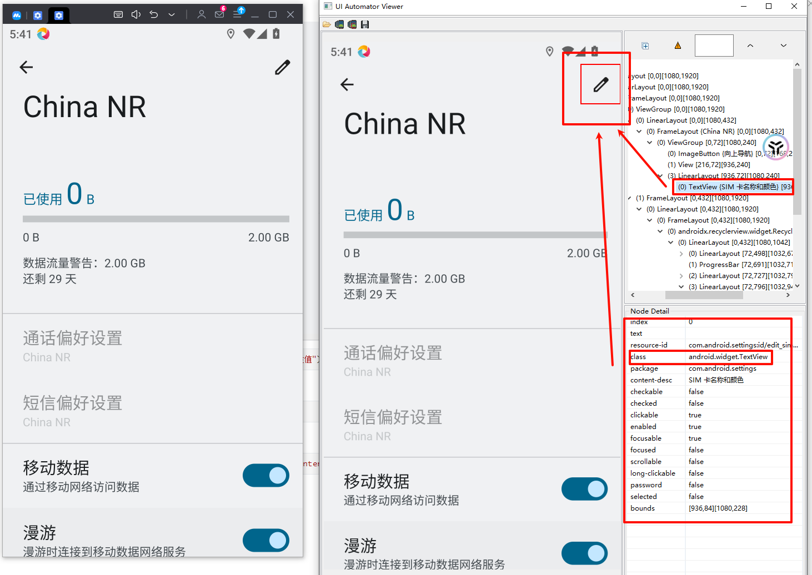
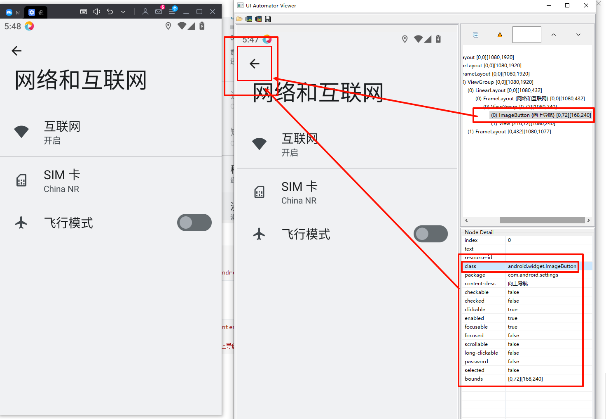
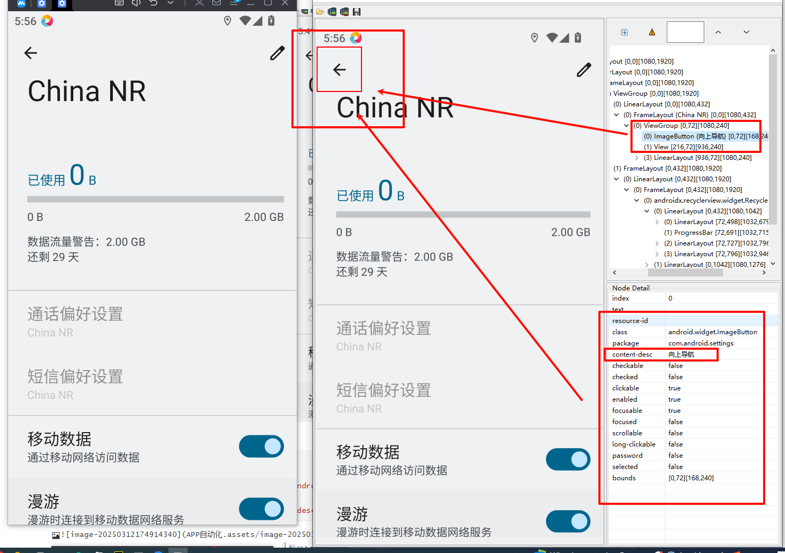

# APP自动化

以下操作只适用于appium 2.0以上版本

## 1、连接步骤

#### 1.1启动appium，命令行界面

有两种启动方式

```cmd
appium --base-path /wd/hub
#  Appium 服务器以 /wd/hub/ 作为基路径启动

appium
```

##### 1.2.1 使用mumu模拟器连接

```cmd
adb connect 127.0.0.1:7555 
# 默认的端口号为7555
```

##### 1.2.2 使用cmd命令行连接

```cmd
emulator -avd first_1
# first_1 是在Android Studio中创建的虚拟机名称

emulator -list-avds
# 使用上述命令查看已创建的模拟器，只适用于Android Studio
```

##### 1.2.3 使用Android Studio直接运行模拟器

##### 1.2.4 使用Genymotioin直接运行

使用下述命令确认模拟器是否连接成功

```cmd
adb devices
```

返回结果：

```cmd
192.168.190.102:5555    device
# IP地址为模拟器名称   后面表示连接成功，若为offline则表示连接失败
```

##### 1.2.5 连接示例：

假如你使用的mumu模拟器

1 启动appium服务



2 连接模拟设备


3 确认连接成功



## 2、代码示例：

```python
import time
from appium import webdriver
from appium.webdriver.common.appiumby import AppiumBy
# 初始化 desired_caps 字典
desired_caps = {
    'platformName': 'Android',  # 设备的系统
    'platformVersion': '12',  # 设备的版本
    'deviceName': '127.0.0.1:7555',  # 设备ID或模拟器ID
    'appPackage': 'com.android.settings',  # 设置应用包名
    'appActivity': 'com.android.settings.Settings',  # 设置应用启动的活动
    "appium:automationName": "UiAutomator2"  # ✅ 添加 automationName
}
# 打印 desired_caps 确认配置正确
print("Desired capabilities:")
for key, value in desired_caps.items():
    print(f"{key}: {value}")
# 初始化 WebDriver 会话，连接到 Appium 服务器
try:
    driver = webdriver.Remote("http://127.0.0.1:4723/wd/hub", desired_caps)
    print("Driver successfully started")
except Exception as e:
    print(f"Failed to start driver: {e}")
element = driver.find_element(AppiumBy.XPATH, "//android.widget.TextView[@text='应用']")
element.click()
# 模拟点击设置界面的 应用 
time.sleep(3)
driver.quit()
```

##### 2.1 获取信息

获取platformVersion

```cmd
adb shell getprop ro.build.version.release

# 会返回当前系统的版本
12
```

获取deviceName

```cmd
adb devices
```

###### 2.1.1 获取界面名和包名

```cmd
adb shell dumpsys window | findstr mCurrentFocus

# 返回的结果如下：
mCurrentFocus=Window{784f82d u0 com.android.settings/com.android.settings.Settings}

#其中 包名（packageName）为：com.android.settings
#    界面名（activityName）为：com.android.settings.Settings
```

##### 2.2 文件传输

adb push 源地址  目的地址

adb pull 源地址  目的地址

 

## 3、基础操作

### 3.1 应用跳转

```python
driver.activate_app("tv.danmaku.bili")
# tv.danmaku.bili为需要跳转APP的packageName
```

### 3.2 获取当前APP的报名和界面名

```python
driver.current_package
# 获取包名

driver.current_activity
# 获取界面名
```

### 3.3 关闭驱动和APP

```python
driver.terminate_app("com.android.settings")
# com.android.settings 为需要关闭APP的packageName
```

### 3.4  安装APP

```python
driver.install_app(f'D:/APP_Test/bilibili.apk')
# D:/APP_Test/bilibili.apk 为安装APP完整路径
```

### 3.5 卸载APP

```python
driver.remove_app('tv.danmaku.bili')
# tv.danmaku.bili为packageName
```

### 3.6 判断APP是否安装

```python
driver.is_app_installed("tv.danmaku.bili")
# tv.danmaku.bili为packageName
```

### 3.7 置于后台

```python
driver.background_app(5)
# 5 为需要停留的秒数
```

### 3.8 清除text文本

```python
driver.find_element(AppiumBy.CLASS_NAME,"android.widget.EditText").clear()
# android.widget.EditText 元素为text文本框
```

### 3.9 使用Xpath时，包含元素定位

```python
driver.find_element(AppiumBy.XPATH, "//*[contains(@text, '网')]")
# 查看包含 网 的元素，如果不使用 find_elements 则默认第一个
```

### 3.10 点击、输入

```python
driver.find_element(AppiumBy.XPATH, "//*[contains(@text, '网')]").click()
driver.find_element(AppiumBy.XPATH, "//*[contains(@text, '网')]").send_keys("想要输入的内容")
```

### 3.11 获取屏幕分辨率

```python
str=driver.get_window_size()
print(str)
# 返回的是字典   {'width': 1080, 'height': 1920}
```

### 3.12  等待设置应用加载完成

```Python
driver.implicitly_wait(10)  
# 隐式等待10秒
```

### 3.13 截图操作

```Python
driver.get_screenshot_as_file("{}.png".format(time.strftime('%Y-%m-%d %H-%M-%S')))
# 将时间戳作为文件名
```

 

## 4、元素定位

双击Android SDK 安装路径下的==**\tools\bin\uiautomatorviewer.bat**==文件

**需要使用jdk8，使用8以上无法使用该文件**



点击1则会出现与模拟器一样的界面

### 4.1 单个元素定位

```python
driver.find_element(AppiumBy.ID,"resource-id属性值")
driver.find_element(AppiumBy.CLASS_NAME,"class属性值")
driver.find_element(AppiumBy.XPATH,"xpath表达式")
driver.find_element(AppiumBy.ACCESSIBILITY_ID,"content-desc属性值")
```

#### 4.1.1 通过 **ID** 定位

```python
driver.find_element(AppiumBy.ID,"resource-id属性值")

driver.find_element(AppiumBy.ID,"android:id/title").click()
```



#### 4.1.2 通过 **CLASS_NAME** 定位

```python
driver.find_element(AppiumBy.CLASS_NAME,"class属性值")

driver.find_element(AppiumBy.CLASS_NAME,"android.widget.TextView").click()
```



#### 4.1.3 通过 **XPATTH** 定位

```python
driver.find_element(AppiumBy.XPATH,"xpath表达式")

driver.find_element(AppiumBy.XPATH,'//*[@class="android.widget.ImageButton"]').click()
or
driver.find_element(AppiumBy.XPATH,'//*[@content-desc="向上导航"]').click()
```



#### 4.1.4 通过 **ACCESSIBILITY_ID** 定位

```python
driver.find_element(AppiumBy.ACCESSIBILITY_ID,"content-desc属性值")

driver.find_element(AppiumBy.ACCESSIBILITY_ID,'向上导航').click()
```



### 4.2 获取一组元素

```python
res=driver.find_elements(AppiumBy.ID,'android:id/title')
for re in res:
    print(re.text)
print(end="\n")
driver.find_elements(AppiumBy.ID,'android:id/title')[0].click()
driver.quit()

# 输出如下：
网络和互联网
应用
通知
存储
声音
显示
壁纸
无障碍
```

使用定位一组元素时，返回的数据是列表，所以需要使用 text 方法

所以在实际中，如果存在多个相同的ID属性值，可以将所有相同的ID全部打印出来，再利用下标对想要点击的数据写进去

### 4.3 获取元素文本、位置、大小

分别使用：

**text**     **location**     **size**

```python
res=driver.find_elements(AppiumBy.ID,'android:id/title')[0]
print(f"这个元素的文本为：{res.text},位置为：{res.location},大小为：{res.size}")
```

### 4.4 获取元素属性值

使用 **get_attribute**

常见的属性名与属性值的对应关系有：


上图没有的则与UI中对应

```python
res=driver.find_elements(AppiumBy.ID,'android:id/title')
for i in res:
    text = i.get_attribute('text')
    enable=i.get_attribute('enabled')
    name=i.get_attribute('name')
    class_name=i.get_attribute('className')
    res_id=i.get_attribute('resourceId')
    print(f"text为：{text} enable为：{enable} name为：{name} class_name为：{class_name} id为：{res_id}")
```

### 4.5 滑动和拖拽

#### 4.5.1 **Swipe**滑动：从一个坐标位置滑动到另一个坐标位置，只能是两点之间的滑动

```python
driver.swipe(start_X,start_Y,end_X,end_Y,duration=None)
"""
start_X:起点X轴坐标
start_Y：起点Y轴坐标
end_X：终点X轴坐标
end_Y：终点Y轴坐标
duration=None：滑动这个操作的持续时间，单位：ms
"""

driver.swipe(666,1523,666,804,duration=0)
# 这个案例中，模拟的是向上滑动
```

如果换了手机，导致分辨率率不一样，可以使用下面方法：

```python
size=driver.get_window_size()
# 获取整个屏幕的分辨率大小
time.sleep(3)
start_Y=size.get("height")*0.75
# 获取起始点的坐标
end_Y=size.get("height")*0.25
# 结束点的坐标
driver.swipe(200,start_Y,200,end_Y,duration=0)
```

#### 4.5.2 **scroll** 滑动：从一个元素滑动到另一个元素，知道页面自动停止

```python
driver.scroll(origin_el=,destination_el=)
"""
origin_el：滑动开始的元素
destination_el：滑动结束的元素
"""

driver.scroll(origin_el=src,destination_el=dst)
```

#### 4.5.3 **drag_and_drop** 拖拽：从一个元素滑动到另一个元素，第二个元素替代第一个元素原本屏幕上的位置

```python
driver.drag_and_drop(origin_el=,destination_el=)
"""
origin_el：滑动开始的元素
destination_el：滑动结束的元素
"""
driver.drag_and_drop(origin_el=src,destination_el=dst)
```

以上两种方法都可以使用下面的方法（appium 2.0 以上）：

```python
driver.execute_script("mobile:dragGesture", {
    "elementId": src.id,
    # 拖拽的起点元素
    "endX": dst.location["x"],
    # 目标位置的X坐标
    "endY": dst.location["y"]
    # 目标位置的Y坐标
```

### 4.6 TouchAction

####  4.6.1 轻敲：模拟手指对某个元素或坐标按下并快速抬起

```python
ele=driver.find_element(AppiumBy.XPATH,"//*[@text='已连接']")
ActionChains(driver).move_to_element(ele).click().perform()
# 创建一个ActionChains对象，使用滑动到指定的ele元素处，并执行点击操作

```

#### 4.6.2 长按：模拟手指对元素或坐标的长按操作

```python
ele=driver.find_element(AppiumBy.XPATH,"//*[@text='已连接']")
# 获取元素坐标位置
x=ele.location['x']
# 获取元素X轴坐标
y=ele.location['y']
# 获取元素Y轴坐标
driver.tap([(x,y)], 5000)
# 在指定的坐标上执行轻敲操作，并持续5秒
```

### 4.7 模拟解锁手机九空格图案

```python
from appium import webdriver
from appium.webdriver.common.appiumby import AppiumBy
from selenium.webdriver.common.actions.action_builder import ActionBuilder
from selenium.webdriver.common.actions.interaction import POINTER_TOUCH
from selenium.webdriver.support.ui import WebDriverWait
from selenium.webdriver.support import expected_conditions as EC

# 配置参数
desired_caps = {
    'platformName': 'Android',
    'appium:automationName': 'UiAutomator2',
    'appium:deviceName': 'emulator-5556',
    'appium:platformVersion': '9',
    'appium:appPackage': 'com.android.settings',
    'appium:appActivity': 'com.android.settings.Settings',
}

def unlock():
    pattern = [
        (268, 919), (540, 919), (812, 919),
        (268, 1193), (540, 1193), (812, 1193),
        (268, 1463), (540, 1463), (812, 1463)
    ]
    # 解锁路径，使用九宫格索引（0 - 8），按顺序依次连接点
    unlock_path = [4, 2, 7, 0, 5, 6, 1, 8, 3]  # 使用索引更易维护
    # 根据解锁路径获取具体的坐标点
    unlock_points = [pattern[i] for i in unlock_path]

    # 创建 W3C Actions（高级触摸手势）
    actions = ActionBuilder(driver)

    # 添加 PointerInput（用于触摸输入）
    actions.add_pointer_input(POINTER_TOUCH, "finger_input")

    # 开始绘制解锁图案
    actions.pointer_action \
        .move_to_location(*unlock_points[0]) \
        .pointer_down() \
        .pause(0.1)  # 初始按压停顿

    # 按照路径顺序移动到每个点
    for point in unlock_points[1:]:
        (actions.pointer_action \
         .move_to_location(*point) \
         # 移动到下一个点
         .pause(0.05))
        # 轻微停顿，使滑动更流畅

    # 释放触摸（松开手指）
    actions.pointer_action.pointer_up()
    # 执行手势操作
    actions.perform()
    print("九宫格解锁成功！")


try:
    # 初始化驱动
    driver = webdriver.Remote("http://127.0.0.1:4723/wd/hub", desired_caps)

    # 导航到九宫格设置
    # wait_click(driver, AppiumBy.XPATH, "//*[@text='安全性和位置信息']")
    # wait_click(driver, AppiumBy.XPATH, "//*[@text='屏幕锁定']")
    # wait_click(driver, AppiumBy.XPATH, "//*[@text='图案']")
    WebDriverWait(driver, timeout=20).until(
        EC.element_to_be_clickable((AppiumBy.XPATH, "//*[@text='安全性和位置信息']"))).click()
    WebDriverWait(driver, timeout=20).until(
        EC.element_to_be_clickable((AppiumBy.XPATH, "//*[@text='屏幕锁定']"))).click()
    WebDriverWait(driver, timeout=20).until(EC.element_to_be_clickable((AppiumBy.XPATH, "//*[@text='图案']"))).click()
    # 九宫格解锁坐标（需要根据设备的实际分辨率调整）
    unlock()
    WebDriverWait(driver, timeout=20).until(EC.element_to_be_clickable((AppiumBy.XPATH, "//*[@text='下一步']"))).click()
    unlock()
    WebDriverWait(driver, timeout=20).until(EC.element_to_be_clickable((AppiumBy.XPATH, "//*[@text='确认']"))).click()
except Exception as e:
    print(e)
finally:
    # 确保退出 WebDriver，释放资源
    if 'driver' in locals():
        driver.quit()
        print("退出成功！")
```

### 4.8 获取和设置手机网络

```python
res=driver.network_connection
print(res)
'''
获取网络状态，返回一个整数
0	无网络
1	飞行模式
2	WiFi
4	流量
6	流量和WiFi
'''

driver.set_network_connection(connection_type=0|1|2|4|6)
# 设置手机网络
```

### 4.9 发送键到设备

```python
driver.press_keycode(keycode=)
# keycode 表示手机设备的默认键码
# 详情见：https://blog.csdn.net/yaoyaozaiye/article/details/122826340
```

### 4.10 打开通知栏

```python
driver.open_notifications()
<<<<<<< HEAD
# 退出可以通过上面的发送键来模拟返回键操作
```

### 4.11 获取toast信息

1、何为toast：操作过程中弹出的立即消失的弹出框，本质上他也是页面的一个内容

2、如何获取toast：建议使用xpath查询，因为使用工具很难定位到元素

```Python
WEb = WebDriverWait(driver, 10,0.1).until(lambda x: x.find_element(AppiumBy.XPATH,"//*[contains(@text,'请先')]"))
print(WEb.text)
# 在这个界面等待10秒，每0.1秒检查一次，使用xpath查找页面上是否有包含‘请先’的元素
# 最后在界面上会打印“请先登录”
```

### 4.12 webview 元素定位

1、浏览器本身是native的应用，使用之前的native元素定位、交互即可

2、网页不分的内容是HTML页面，和native部分使用了不同上下文，做完native部分的交互（地址输入、回车访问）之后。需要切换到HTML页面，代码如下：

```Python
driver.switch_to.context(上下文对象)
# 在原生应用和webview之间进行切换
```

3、切换完之后使用web页面自动化的方式定位元素、进行操作即可

4、注意：如果模拟器上的浏览器为Chrome，web页面的定位只能使用CSS、XPATH进行定位，其他的不支持

环境准备：

在自己的浏览器中输入：https://liulammi.com/labs/core.html    

或者在cmd中输入：adb shell am start -a android.intent.action.VIEW -d https://liulanmi.com/labs/core.html     查看版本

**chromedriver 115及115之后版本下载地址：**https://googlechromelabs.github.io/chrome-for-testing/

**chromedriver 115之前版本下载地址：**https://chromedriver.storage.googleapis.com/index.html 


=======
```

>>>>>>> 99ec674d0e6a1c026f52dd82cb9817c488409721
